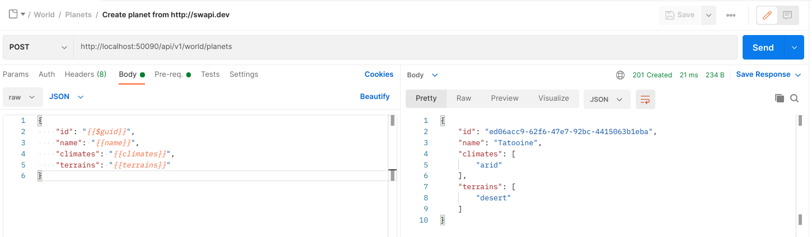
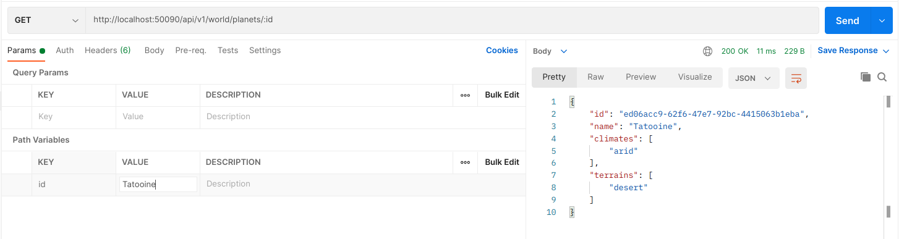
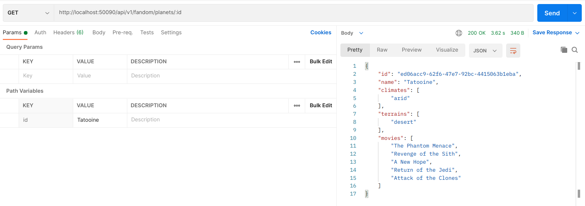
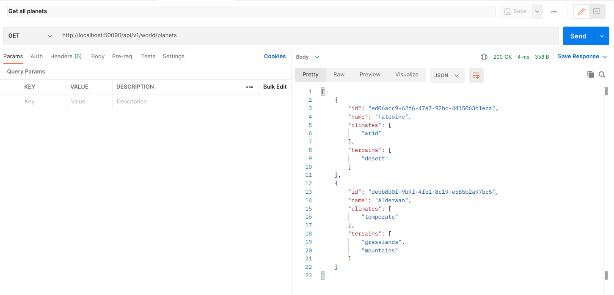
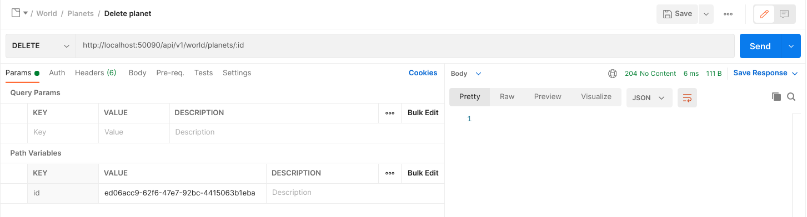

# Star Wars Api

## 1. Instalação

### 1.1 Dependências
* `sudo apt install build-essential`
* `docker v20.10.2` https://docs.docker.com/engine/install/
* `docker-compose v1.25.0` https://docs.docker.com/compose/install/
* `golang v1.16` https://golang.org/dl/

### 1.2 Testes
Para rodar todos os testes
> `make test`

### 1.3 Rodando
> `make run`

Após executar o comando acima a api estará pronta pra aceitar conexões:

> `curl -LX GET http://127.0.0.1:50090/api/v1/world/planets`

Para ter uma melhor experiência, importe o arquivo `starwars.postman_collection.json` no postman.

Esta url irá criar planetas automaticamente a partir da `https://swapi.dev`, apenas aperte `Send`.

Esta url aceita tanto id quanto o nome do planeta como parametro.

Esta url funciona como a anterior, porém ela trás todos os filmes que esse planeta apareceu.

Buscando todos os planets.

Deletando um planeta.

### 1.4 Limpando

> `make clean`
